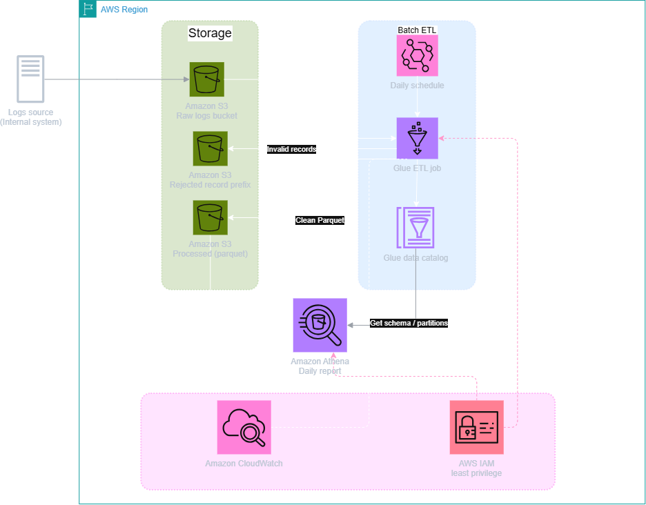

# Thiết kế AWS cho pipeline log hằng ngày

Sơ đồ chỉnh sửa được lưu tại `AWS_pipeline.drawio`. Đây là paper design cho daily batch; hạ tầng chưa được deploy trên AWS.

## Luồng dữ liệu

1. Hệ thống khách hàng upload JSONL vào **S3 raw bucket**. Bucket này là append-only đối với pipeline để giữ nguyên log phục vụ audit và replay.
2. **Amazon EventBridge** chạy theo lịch hằng ngày và khởi động **AWS Glue ETL job** sau thời điểm log dự kiến đã được gửi đủ.
3. Glue áp dụng logic Phần A: validate JSON/schema/timestamp, deduplicate `request_id`, chuẩn hóa UTC và tạo các trường lỗi có cấu trúc. Clean records được ghi thành **Parquet** vào processed bucket, partition theo `event_date`; invalid records được ghi vào rejected prefix kèm nguồn và lý do.
4. **Glue Data Catalog** giữ schema và partition metadata. **Amazon Athena** dùng Catalog để query trực tiếp clean Parquet cho báo cáo hằng ngày, không cần database riêng.
5. **CloudWatch** thu thập Glue logs/status/runtime và cảnh báo job fail hoặc timeout. Số rejected records được theo dõi để phát hiện data-quality thay đổi bất thường.

## Quyết định và lý do

| Quyết định | Lý do |
| --- | --- |
| Tách raw và processed bucket | Tránh ETL ghi đè dữ liệu gốc; hỗ trợ audit và replay. |
| Rejected prefix riêng | Không trộn invalid records với clean Parquet nhưng vẫn giữ dữ liệu để điều tra. |
| Parquet + partition ngày | Nén tốt và giúp Athena giảm dữ liệu cần scan. |
| EventBridge + Glue | Phù hợp workload batch hằng ngày và không cần vận hành server. |
| Catalog + Athena | Query dữ liệu trên S3 với chi phí phù hợp tần suất báo cáo thấp. |
| IAM least privilege | Glue chỉ đọc raw và ghi processed/rejected; reporting chỉ đọc processed. Quyền ghi raw chỉ thuộc ingestion producer. |

## Giới hạn

Thiết kế chưa mô tả cơ chế ingest cụ thể phía hệ thống khách hàng, encryption key, retention/lifecycle hay kiểm tra một daily run hoàn toàn không khởi động. Trường hợp cuối cần thêm expected-run/heartbeat monitor; CloudWatch alarm trên Glue job đơn thuần chỉ bao phủ run đã phát sinh nhưng fail hoặc timeout.
